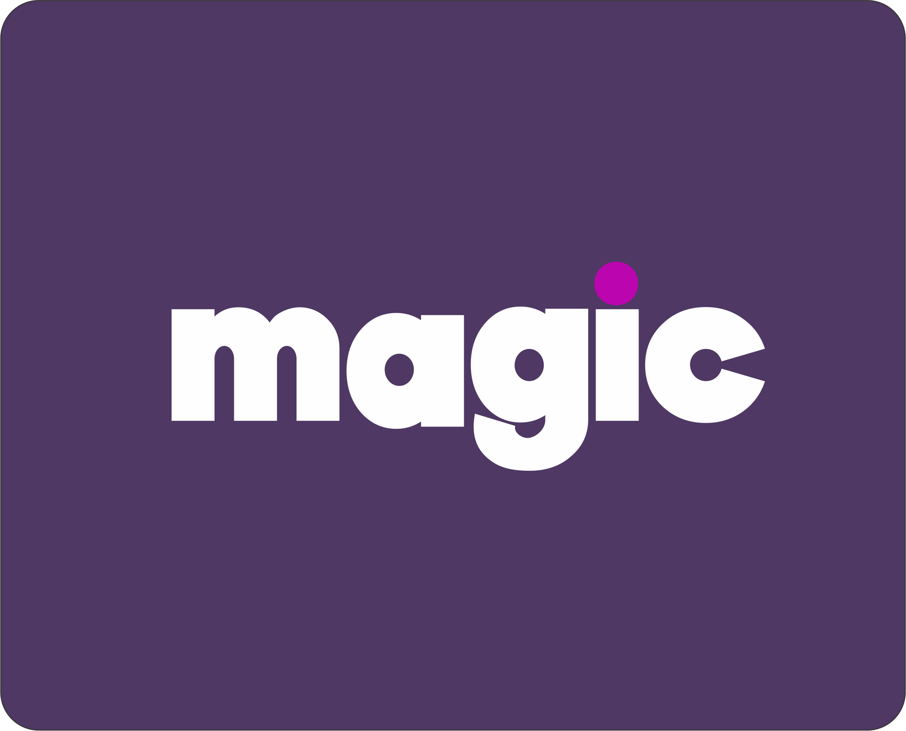

# Site Codi Magic




## 🎯 Resumo do Projeto

Este projeto é um sistema web responsivo desenvolvido para a **Magic**, uma empresa de software. É composto por diversas páginas e funcionalidades:

- **Home:** Página principal no formato de landing page, incluindo um formulário de contato.
- **Projetos:** Página que exibe os projetos desenvolvidos pela empresa.
- **Equipe:** Página que mostra a equipe de desenvolvimento.
- **Login:** Página de autenticação.

### Funcionalidades

| Tipo de Usuário        | Funcionalidades                                                                                                                                 |
|------------------------|-------------------------------------------------------------------------------------------------------------------------------------------------|
| **Usuário Comum**       | Pode fazer login para acompanhar o desenvolvimento do seu projeto. Acesso às páginas Home, Projetos, Equipe e Login.                            |
| **Administrador (Admin)** | Acesso a todas as páginas e a uma dashboard com funcionalidades de CRUD e gerenciamento de contatos.                                          |
| **Usuário Não-Cadastrado** | Acesso apenas às páginas Home, Projetos, Equipe e Login. Tentativa de login sem cadastro não é permitida.                                     |

## 🚀 Tecnologias Utilizadas

- **Frontend:**
  - React
  - Bibliotecas do React

- **Backend:**
  - Node.js com TypeScript (segurança)
  - JWT (JSON Web Token) para autenticação
  - Prisma como ORM (Object-Relational Mapping)
  - SQLite como banco de dados

## 📋 Instruções de Instalação

### Passos para Executar o Projeto

1. **Clone o repositório:**

   ```bash
   git clone https://github.com/codiacademy/ChallengeV-noiteufjf.git

2. **Navegue até a pasta do projeto:**

   ```bash
   cd ChallengeV-noiteufjf
   ```

3. **Instale as dependências em cada pasta individualmente:**

   Usando npm:

   ```bash
   cd frontend
   npm install
   ```
   ```bash
   cd backend
   npm install
   ```

4. **Configure as variáveis de ambiente:**

   Crie um arquivo `.env` na pasta backend do projeto e configure as variáveis necessárias. Por exemplo:

   ```makefile
   DATABASE_URL="file:./dev.db"
   ```

5. **Execute as migrações do banco de dados:**

   ```bash
   npx prisma migrate dev
   ```

6. **Inicie o servidor de desenvolvimento:**

   Usando npm:

   ```bash
   npm run dev
   ```

7. **Acesse o projeto no navegador:**
   - O servidor estará rodando em `http://localhost:5173`


